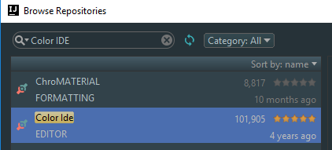
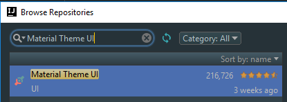
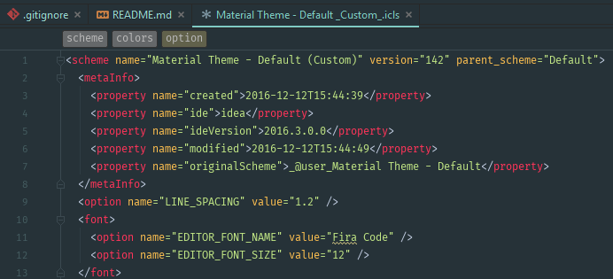
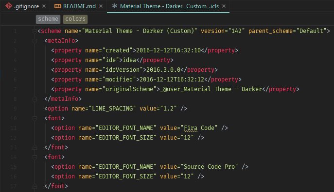

# idea-material-theme
IntelliJ IDEA, WebStorm, PHPStorm Material UI theme modification

Custom colors based on [Material Theme](http://equinsuocha.io/material-theme/#/default) for IntelliJ idea products (_Used IntelliJ IDEA 16.2+_).

## Setup

* Goto IDEA `Settings->Plugins` and install *Color IDE* and *Material UI* with `Browse repostories...`.

* Copy `*.icls` in your IDEA `config/colors` folder and restart IDEA if it's opened. You can find your settings folder location [here](https://intellij-support.jetbrains.com/hc/en-us/articles/206544519).

* Open settings, goto `Editor -> Color And Fonts` and select `Material Theme - Default (Custom)`.

### Using Darker Theme

* Follow instructions from here: https://github.com/ChrisRM/material-theme-jetbrains
* Select `Material Theme - Darker (Custom)` from `Color and Fonts`.

## Changes from the default

Changes applied on top of the default material UI color scheme:

* Font size changed from 15px to 12px (_I prefer smaller font showing more content on the screen_)
* Line height changed from 1.6 to 1.2 (_Better looking with smaller font size_)
* *Breadcrumbs* colors were not matching the dark them so I used the colors from IDEA Darcula theme for them.
* *Annotation* colors were Light. Colors changes to matched Darcula theme.

  
_Theme Preview (Default)_

  
_Theme Preview (Dark)_

## More

* Great [Laracasts](https://laracasts.com/series/setup-a-mac-dev-machine-from-scratch/episodes/3) tutorial on customizing PHP Storm
* Laracasts on how to [Be Awesome in PHPStorm](https://laracasts.com/series/how-to-be-awesome-in-phpstorm).